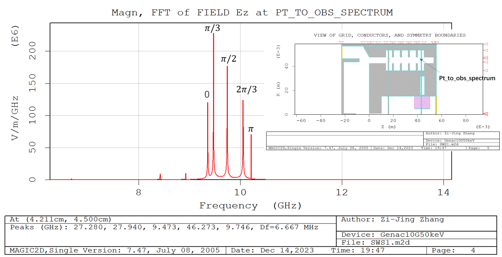
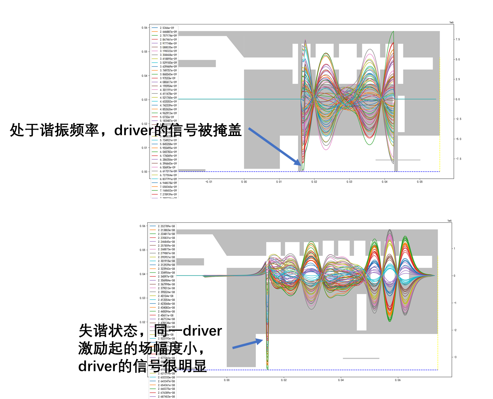

# 设计草稿
## 根据脉冲响应谱
如图，将 $2\pi/3$模式的频率调至10.0 GHz处。

考虑到左侧还有一些杂模，因此应对上图频谱先聚类，在聚类得到的第一个类中排序，选出前5个（根据短路面的位置）峰，再按照频率升序排列。聚类可行的前提：不同横模（TM01, TM02, ...）的色散曲线之间的禁带较宽。因此对于过模结构，这一算法将失效。
## 根据range Ez
可通过叠加不同时间片的range Ez判断结构是否处于谐振状态：
